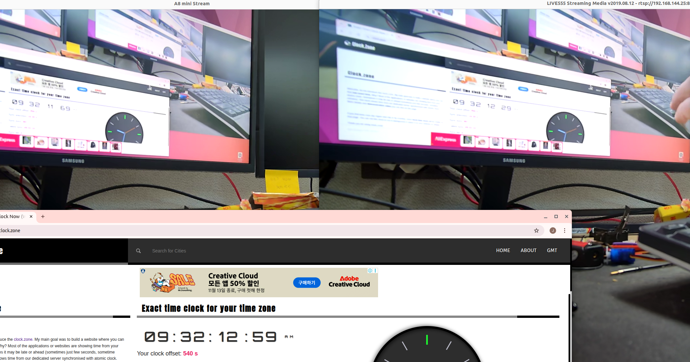

# SIYI A8 Mini — siyi_a8mini / a8mini_msgs

[Banner image](assets/banner.jpg)

English / 한국어 (bilingual)

## Table of contents / 목차

- [Overview / 개요](#overview--개요)
- [Quick start / 빠른 시작](#quick-start--빠른-시작)
- [Architecture / 아키텍처](#architecture--아키텍처)
- [Environment / 환경 구성](#environment--환경-구성)
- [Installation / 설치 방법](#installation--설치-방법)
- [Usage / 사용법](#usage--사용법)
- [Topics & Services / 토픽 및 서비스](#topics--services--토픽-및-서비스)
- [Performance / 성능](#performance--성능)
- [Troubleshooting / 문제 해결](#troubleshooting--문제-해결)
- [Testing / 테스트](#testing--테스트)
- [Contributing / 기여 방법](#contributing--기여-방법)
- [License / 라이선스](#license--라이선스)

---

## Overview / 개요

English

This workspace contains two ROS2 packages built around a Python SDK for SIYI A8 Mini:

- `a8mini_msgs` — message definitions (e.g. `SystemInfo.msg`).
- `siyi_a8mini` — Python nodes and SDK (gimbal control, RTSP video streaming).

한국어

이 워크스페이스는 A8 Mini용 Python SDK 기반의 두 개의 ROS2 패키지를 포함합니다:

- `a8mini_msgs` — 메시지 정의 (예: `SystemInfo.msg`).
- `siyi_a8mini` — 짐벌 제어 노드와 RTSP 비디오 스트리밍 노드를 포함한 Python 패키지.

---

## Quick start / 빠른 시작

1. Create and activate a Python virtualenv, install Python deps:

```bash
python3 -m venv .venv
source .venv/bin/activate
pip install -U pip setuptools wheel
pip install -r siyi_a8mini/requirements.txt
```

2. Source ROS2 and build the workspace:

```bash
source /opt/ros/humble/setup.bash   # change to your ROS2 distro if needed
colcon build --packages-select a8mini_msgs siyi_a8mini
source install/setup.bash
```

3. Launch both nodes:

```bash
ros2 launch siyi_a8mini a8mini.launch.py
```

---

## Architecture / 아키텍처

English

The repository intentionally separates functionality into two processes to avoid C++ initialization conflicts between `rclpy` and OpenCV/GStreamer.

- `gimbal_control_node` — handles SIYI SDK communication, telemetry, and services (no OpenCV).
- `video_stream_node` — handles RTSP capture and publishes images (uses OpenCV/FFmpeg).

한국어

rclpy와 OpenCV/GStreamer의 C++ 초기화 충돌을 방지하기 위해 기능을 두 노드로 분리했습니다.

---

## Environment / 환경 구성

Prerequisites (example): Ubuntu 22.04 + ROS2 Humble + Python 3.10+

Install system deps (example):

```bash
sudo apt update
sudo apt install -y python3-colcon-common-extensions ros-humble-desktop ros-humble-cv-bridge python3-opencv ffmpeg
```

Install Python deps (see `siyi_a8mini/requirements.txt`):

```bash
source .venv/bin/activate
pip install -r siyi_a8mini/requirements.txt
```

Important: remove pip-installed `opencv-python` if present; use system `python3-opencv` to avoid segfaults:

```bash
pip uninstall opencv-python opencv-python-headless
sudo apt install python3-opencv
```

---

## Installation / 설치 방법

Build from source:

```bash
source /opt/ros/humble/setup.bash
rm -rf build install log
colcon build --packages-select a8mini_msgs siyi_a8mini
source install/setup.bash
```

Optional editable install for the Python package:

```bash
pip install -e siyi_a8mini
```

---

## Usage / 사용법

### Launching both nodes / 두 노드 함께 실행

```bash
source install/setup.bash
ros2 launch siyi_a8mini a8mini.launch.py
```

### Run nodes individually / 개별 노드 실행

```bash
ros2 run siyi_a8mini gimbal_control_node
ros2 run siyi_a8mini video_stream_node
```

### Debugging by running modules directly

```bash
python3 -m siyi_a8mini.gimbal_control_node
python3 -m siyi_a8mini.video_stream_node
```

---

## Topics & Services / 토픽 및 서비스

Published topics / 발행 토픽 (examples):

- `/A8mini/info` — `a8mini_msgs/SystemInfo` (latched)
- `/A8mini/Gimbal/Info/attitude` — `geometry_msgs/Vector3Stamped`
- `/A8mini/camera/image_raw` — `sensor_msgs/Image`

Common services / 자주 쓰는 서비스:

- `/A8mini/soft_reboot` — `std_srvs/srv/Trigger`
- `/A8mini/Gimbal/mode/toggle_video` — `std_srvs/srv/Trigger`

---

## Performance / 성능

English

Video latency is a key metric. This project reduces CV2/FFmpeg buffering by setting FFMPEG flags via environment variables before importing `cv2`. This is not solved.  [Todo]



Image: latency comparison (left: this node, right: ffplay). Replace `assets/latency_comparison.jpg` with your measured capture.

한국어

비디오 지연 시간을 줄이기 위해 `OPENCV_FFMPEG_CAPTURE_OPTIONS`를 `fflags;nobuffer|flags;low_delay`로 설정한 뒤 `cv2`를 임포트합니다. 본 항목은 해결되지 않았습니다. [Todo]

---

## Troubleshooting / 문제 해결

1) Segfaults (exit code -6 / -11)

- Cause: pip-installed `opencv-python` conflicts with apt `python3-opencv` used by `cv_bridge`.
- Fix: `pip uninstall opencv-python opencv-python-headless` and install system OpenCV.

2) RTSP stream not found / 404

- Test with `ffplay -flags low_delay rtsp://<camera>/main.264` or `video1`/`video2` and update `a8mini.launch.py`'s `rtsp_url` parameter.

3) RViz shows 'No Image' (QoS)


Set the RViz Image display's Reliability Policy to Best Effort.

---

## Testing / 테스트

Run tests:

```bash
source .venv/bin/activate
pytest -q
```

## Contributing / 기여 방법

Open issues and PRs. Run tests and keep changes small. Add or update images in `src/assets/` and reference them in README as shown above.

## Files & assets

- `siyi_a8mini/requirements.txt` — Python dependencies
- `src/.gitignore` — recommended ignores
- `src/assets/` — images used by README (see `src/assets/README.md`)

---

## License / 라이선스

MIT 
